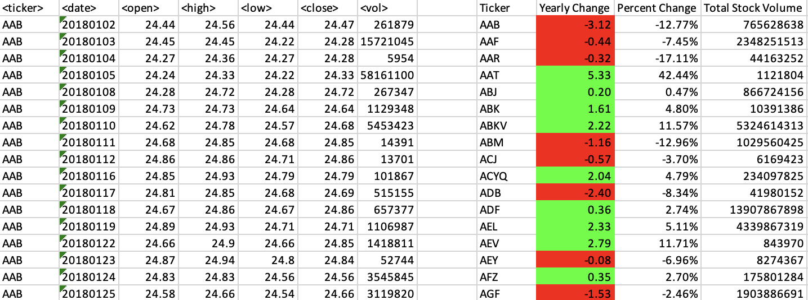
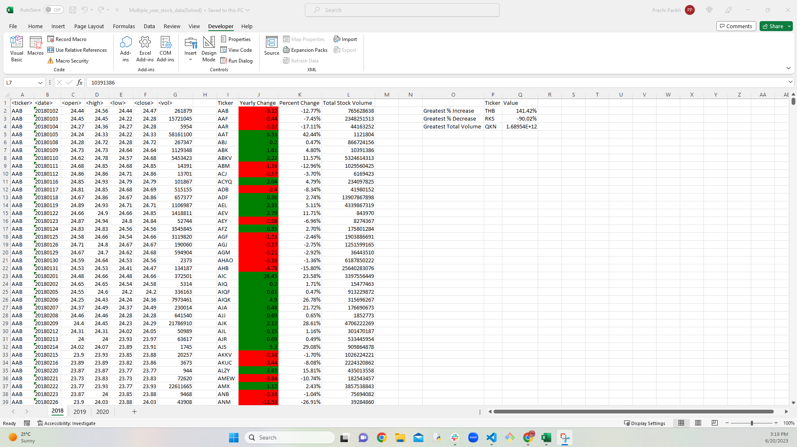
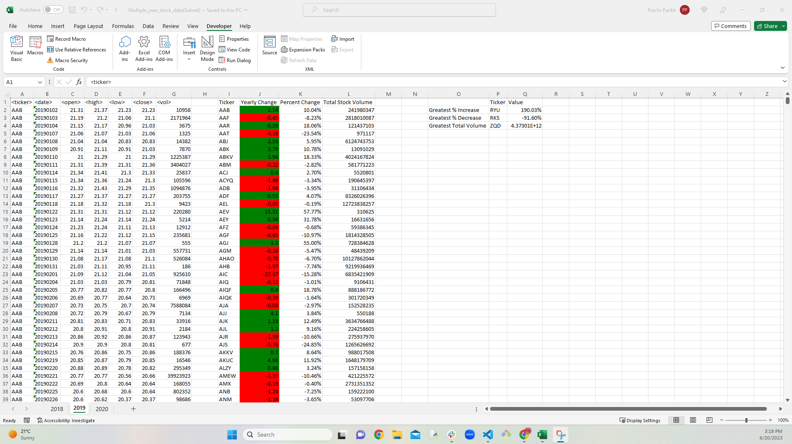
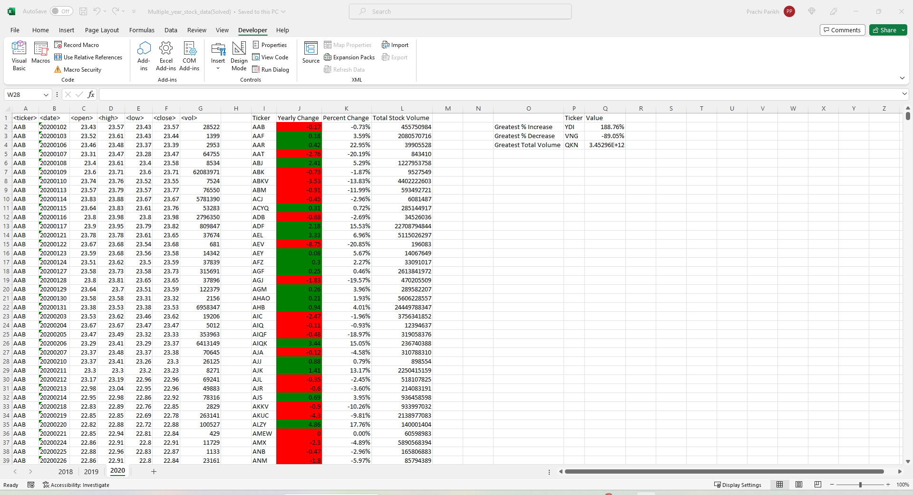

# Module_2_Challenge

### Stock Market Analyst

### Easy

* Create a script that will loop through each year of stock data and grab the total amount of volume each stock had over the year.

* You will also need to display the ticker symbol to coincide with the total volume.

* Your result should look as follows (note: all solution images are for 2015 data).

### Moderate

* Create a script that will loop through all the stocks and take the following info.

  * Yearly change from what the stock opened the year at to what the closing price was.

  * The percent change from the what it opened the year at to what it closed.

  * The total Volume of the stock

  * Ticker symbol

* You should also have conditional formatting that will highlight positive change in green and negative change in red.

* The result should look as follows.

### Hard

* Your solution will include everything from the moderate challenge.

* Your solution will also be able to locate the stock with the "Greatest % increase", "Greatest % Decrease" and "Greatest total volume".

* Solution will look as follows.

# Screen_Shot of the Result.

### Result of Year 2018

### Result of Year 2019

### Result of Year 2020

